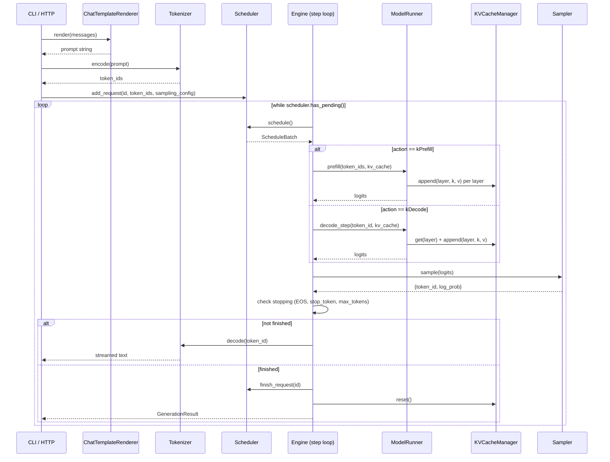

# Request Lifecycle

Full flow of a generation request through the engine, from arrival to completion.

## Sequence Diagram



## Step-by-Step

### 1. Request Ingress

```
Client (CLI --prompt or HTTP POST)
  → ChatTemplateRenderer.render(messages)    // structured turns → formatted prompt
  → Tokenizer.encode(prompt)                 // text → token IDs
  → Scheduler.add_request(id, token_ids, sampling_config)
```

- Raw `--prompt` mode skips the ChatTemplateRenderer entirely.
- The Scheduler enqueues the request. It won't run until `schedule()` selects it.

### 2. Engine Step Loop

The engine calls `scheduler.schedule()` each iteration, which returns a `ScheduleBatch` — the set of sequences to process this step.

**Prefill** (first step for a new request):
```
logits = ModelRunner.prefill(token_ids, kv_cache)
```
- Processes the full prompt in one forward pass through all 42 layers.
- Each layer (that isn't a shared KV layer) calls `KVCacheManager.append()` to store its K/V tensors.
- Returns logits for the last prompt position.

**Decode** (every subsequent step):
```
logits = ModelRunner.decode_step(token_id, kv_cache)
```
- Processes one token (the previously sampled one).
- Each layer calls `KVCacheManager.get()` for cached K/V, then `append()` for the new entry.
- Shared KV layers (24–41) call `get(source_layer)` only — no append.
- Returns logits for the next position.

### 3. Sampling

```
{token_id, log_prob} = Sampler.sample(logits)
```

Pipeline: softcap → temperature → softmax → top_k → top_p → sample.

### 4. Stopping Check

| Condition                         | FinishReason      |
|-----------------------------------|-------------------|
| `token_id == eos_id`              | `kEOS`            |
| `token_id` in `stop_token_ids`    | `kStopToken`      |
| `generated_count >= max_tokens`   | `kMaxTokens`      |

### 5. Output

**Not finished**: Decode the new token via `Tokenizer.decode()`, stream text to client. The engine records the token and loops back to step 2.

**Finished**: Build `GenerationResult` with token IDs, decoded text, finish reason, and timing stats. Call `Scheduler.finish_request()` and `KVCacheManager.reset()` to free resources.

## Phase Differences

| Phase | Batch Size | Scheduling | KV Cache |
|-------|-----------|------------|----------|
| 1     | Always 1  | Trivial (run the single request) | Naive contiguous buffer |
| 5     | Static N  | Collect N, prefill together | Paged blocks |
| 6     | Dynamic   | Priority-based, preemption, mid-decode joins/leaves | Paged blocks + eviction |
