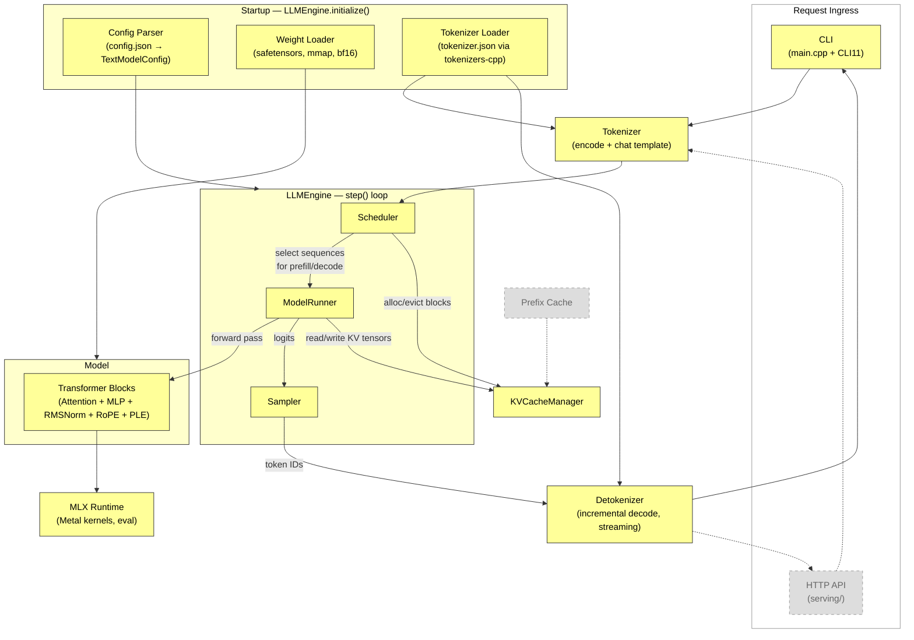

# System Architecture Overview

## Component Diagram



## Legend

| Visual | Meaning |
|--------|---------|
| **Yellow** solid | Phase 0+1 — building now |
| **Gray** dashed | Future phases (Phase 2+) |

## LLMEngine Lifecycle

```
initialize()    Load config, weights, tokenizer. Build model graph. Allocate KV cache.
     │
     ▼
  step()  ◄──── main loop, called repeatedly until all requests complete
     │
     ├─ 1. scheduler.schedule()        → pick sequence(s) to run (prefill or decode)
     ├─ 2. model_runner.execute()      → forward pass through model, read/write KV cache
     ├─ 3. sampler.sample(logits)      → pick next token(s)
     ├─ 4. check stopping conditions   → EOS, max_tokens, stop sequences
     ├─ 5. detokenizer.decode(token)   → incremental text → stream to client
     └─ 6. return results              → finished sequences, streaming tokens
     │
     ▼
 shutdown()     Free KV cache, unload weights, release Metal resources.
```

## Component → Source Mapping

| Component | Source Location | Phase |
|-----------|---------------|-------|
| CLI | `src/main.cpp` | 1 |
| HTTP API | `src/serving/` | 9 |
| Config Parser | `src/core/` or `src/loader/` | 1 |
| Weight Loader | `src/loader/` | 1 |
| Tokenizer / Detokenizer | `src/tokenizer/` | 1 |
| LLMEngine | `src/core/` | 1 |
| Scheduler | `src/scheduler/` | 1 (SimpleScheduler), 6 (ContinuousBatchingScheduler) |
| ModelRunner | `src/model/` | 1 |
| Model / Layers | `src/model/` | 1 |
| KVCacheManager | `src/core/` | 1 (NaiveKVCacheManager), 2–3 (PagedKVCacheManager) |
| Sampler | `src/sampling/` | 1 |
| Prefix Cache | `src/core/` | 8 |
| MLX Runtime | external (FetchContent) | — |

## Interface Hierarchy (Phase 0+1 stubs → later implementations)

```
Scheduler (base)
├── SimpleScheduler              — Phase 1: single request, always run
└── ContinuousBatchingScheduler  — Phase 6: admission, batching, preemption, priority

KVCacheManager (base)
├── NaiveKVCacheManager          — Phase 1: contiguous pre-allocated buffer
└── PagedKVCacheManager          — Phase 2–3: block allocator, paged memory

ModelRunner (base)
└── GemmaModelRunner             — Phase 1: Gemma 4 forward pass
```

## Data Flow Summary

1. **Request in:** CLI (or HTTP) → chat template renders messages → tokenizer encodes to token IDs
2. **Scheduling:** Scheduler picks which sequence(s) to run, allocates KV cache blocks
3. **Execution:** ModelRunner runs prefill or decode step through transformer layers via MLX Metal kernels
4. **Sampling:** Engine passes logits to Sampler, gets next token ID(s)
5. **Output:** Detokenizer incrementally decodes token IDs → streams text back to client
6. **Loop:** Repeat steps 2–5 until EOS, max_tokens, or stop sequence
